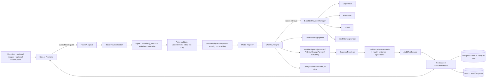
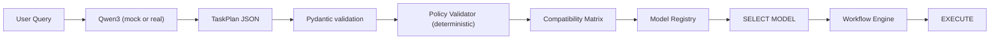
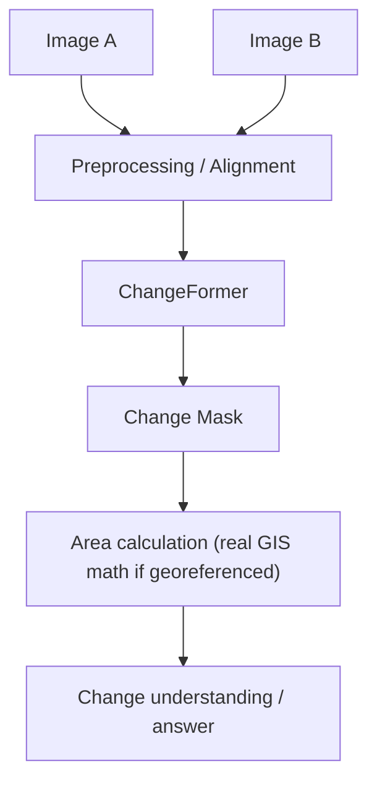
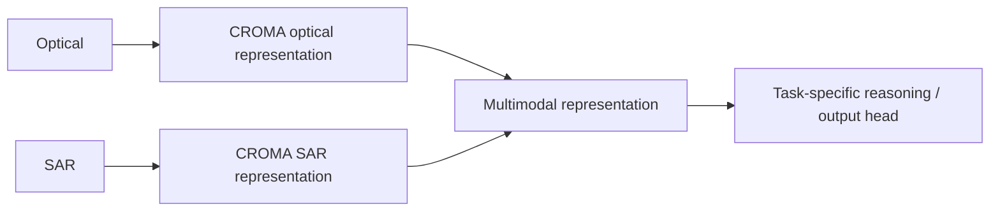
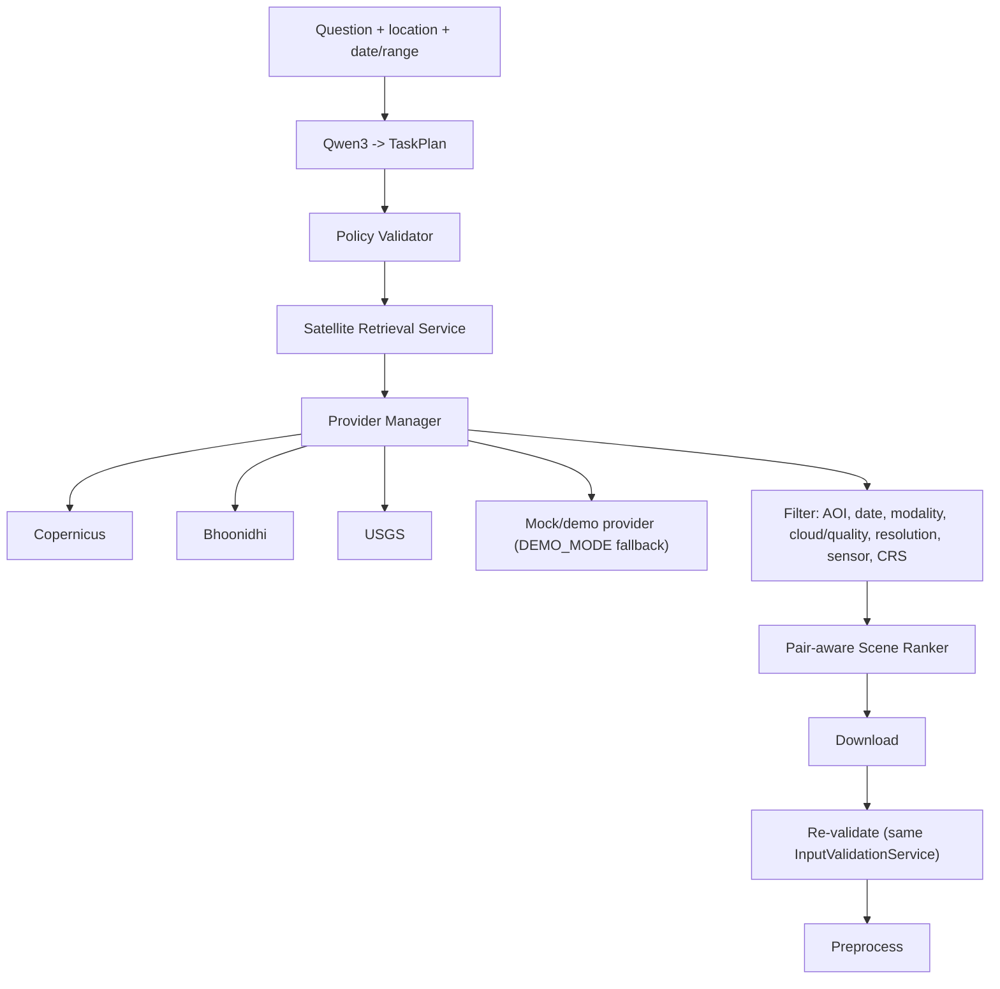
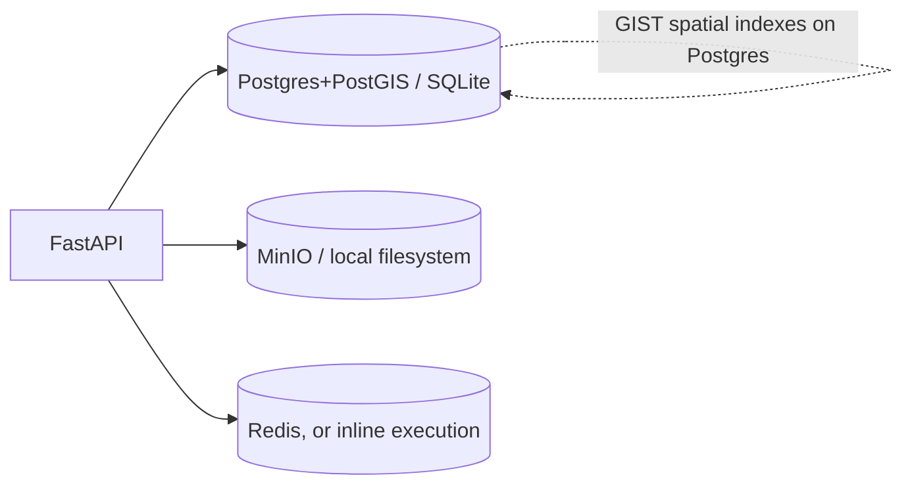
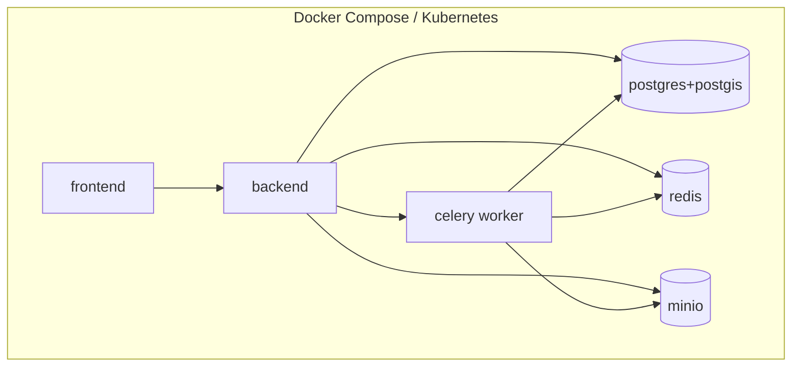

# Architecture

## Design principle

SatQuery AI is an orchestrator, not a chatbot with an upload button. Every query goes
through: understand → validate → plan → select data → select specialist model(s) → execute
→ validate result → generate evidence → calibrate confidence → answer + evidence +
transparency → export. The graph is **dynamically selected per query** — a VQA question
never touches the satellite retrieval or change-detection code paths.

## System architecture



## Agent Controller — model selection is separate from model execution

The LLM (Qwen3, mocked today via a rule/keyword parser) is **boxed**: it only ever produces
a `TaskPlan` (see `backend/app/schemas/task_plan.py`). It cannot name a Python function,
tool, or model.



If the LLM's output doesn't parse into `TaskPlan`, the request is rejected before any model
runs. If a TaskPlan is well-formed but the actually-available inputs don't satisfy it (one
image for a change task, two optical images for an optical+SAR task), the Policy Validator
(`backend/app/agents/policy_validator.py`) rejects it with a fixed, non-LLM-generated
message and never runs the model — this is MVP Tests 8 and 9.

## Execution state machine

```
QUEUED -> BASIC_VALIDATION -> QUERY_UNDERSTANDING -> TASK_PLANNING -> TASK_VALIDATION
       -> DATA_RETRIEVAL (only if needed) -> PREPROCESSING -> MODEL_SELECTION -> RUNNING
       -> RESULT_INTEGRATION -> EVIDENCE_GENERATION -> CONFIDENCE_CALIBRATION -> COMPLETED

Side exits: REQUIRES_USER_INPUT (missing/incompatible input) | FAILED (safe message; full
detail only in the audit log)

Model/provider failure: primary -> HEALTH_CHECK -> (unhealthy) -> APPROVED_FALLBACK ->
RUNNING, always audit-logged ("Primary model unavailable. Approved fallback model X was
used.") -- never a silent switch.
```

Implemented in `backend/app/orchestration/engine.py` (`WorkflowEngine`), with one
`execution_steps` row per transition (`backend/app/audit/service.py`), which is what the
"How Was This Analyzed?" endpoint (`GET /api/v1/analysis/{id}/transparency`) renders.

## Change analysis



ChangeFormer runs independently — it is **not** chained through Prithvi in this prototype
(that integration is unvalidated). Prithvi is a separate, optional representation path used
only when a task explicitly needs a multispectral embedding.

## Optical + SAR fusion



CROMA is a pretrained multimodal **representation** model, not a fusion model that reasons
on its own. In this prototype it's a mock adapter deriving real per-band/backscatter
statistics from the actual input arrays.

## Satellite retrieval



The agent never calls a provider directly. The Provider Manager tries providers in
configured priority order, skips any reporting `unavailable`, and falls back to the
synthetic demo provider only when `DEMO_MODE=true` and every real provider is unavailable —
never presenting demo scenes as real satellite data.

## Data storage



`image_metadata.bounds_geojson`, `satellite_scenes.bbox_geojson`, and
`task_plans.location_json` are portable JSON columns so the schema works unmodified on
SQLite (local dev). A second Alembic migration (`0002_postgis_geometry`) adds real
PostGIS `geometry` columns + GIST indexes derived from that JSON, but is a no-op on any
non-Postgres dialect.

## Deployment architecture



No mandatory public-cloud dependency: `SatelliteDataProvider`, `ObjectStorageBackend`, and
`BaseModelAdapter` are all adapters, so this can run on an internal network / on-premise GPU
server without code changes — only configuration.

## Repository layout

```
SatQueryAi/
├── backend/app/
│   ├── validation/       InputValidationService, modality detection, raster inspection
│   ├── preprocessing/    reproject/resample/co-register/AOI-crop
│   ├── model_adapters/   BaseModelAdapter + 5 adapters (agent, RS-VLM, Prithvi, ChangeFormer, CROMA)
│   ├── model_registry/   models.yaml, registry loader, compatibility matrix
│   ├── agents/           AgentController (Qwen3 wrapper) + Policy Validator
│   ├── orchestration/    WorkflowEngine (state machine), retrieval workflow, image context
│   ├── satellite/        Provider Manager + Copernicus/Bhoonidhi/USGS/Mock providers, ranker
│   ├── evidence/         EvidenceRenderer (bbox/mask/overlay/before-after PNGs)
│   ├── confidence/       ConfidenceService (never fabricates a number in demo mode)
│   ├── audit/            AuditTrailService (execution steps + audit log)
│   ├── storage/          Local filesystem / MinIO object storage abstraction
│   ├── tasks/            Inline / Celery task queue abstraction
│   ├── services/         image ingestion, area calculation, cross-cutting glue
│   └── api/v1/           FastAPI routers
├── ml/                    dataset adapters + training/evaluation scaffolding (not wired to serving)
├── frontend/              Next.js App Router: Sidebar / ChatPanel / EvidencePanel
├── data/demo/             procedurally-generated synthetic demo imagery + manifest
└── scripts/generate_demo_data.py
```
